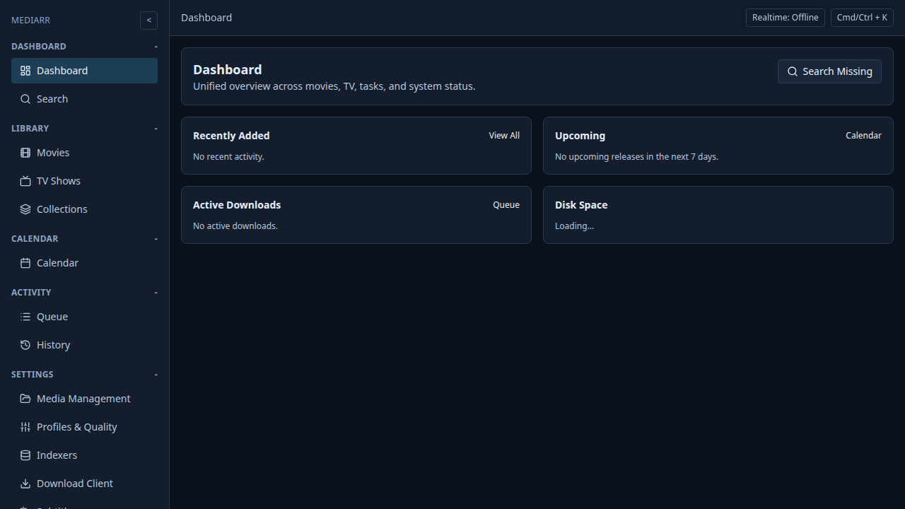
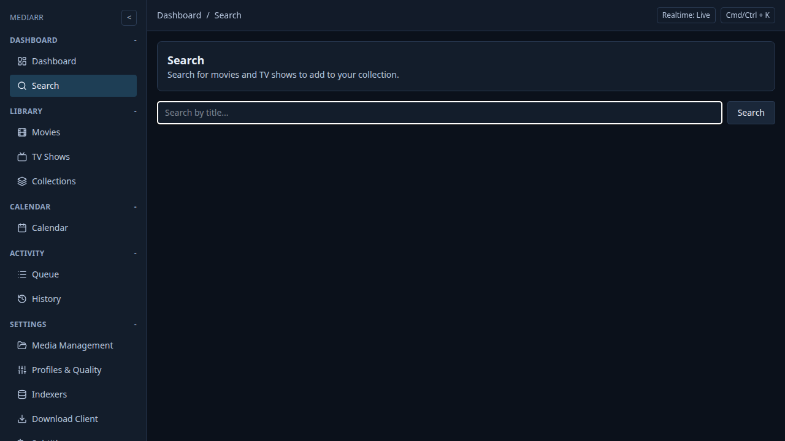
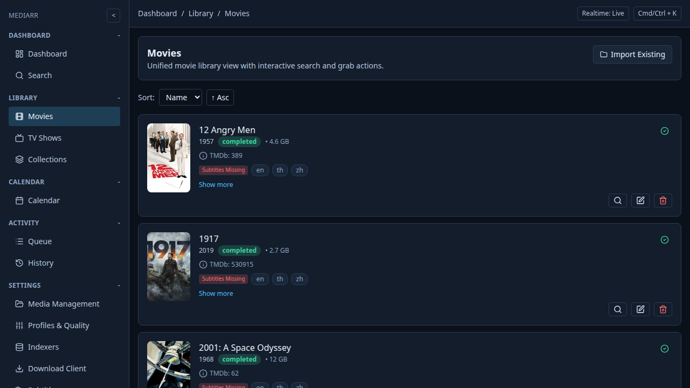
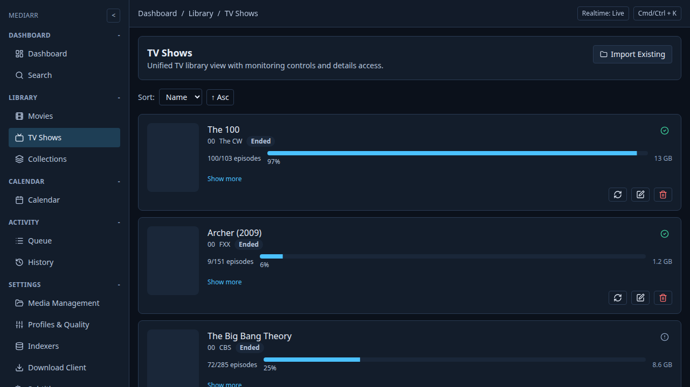
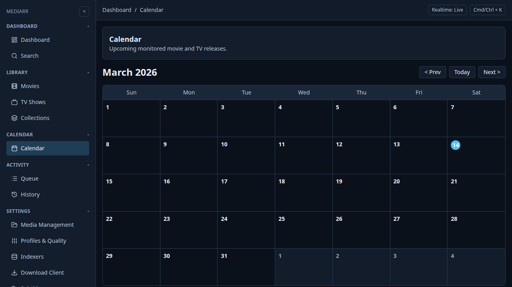
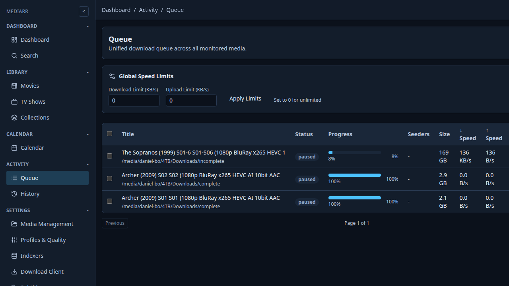
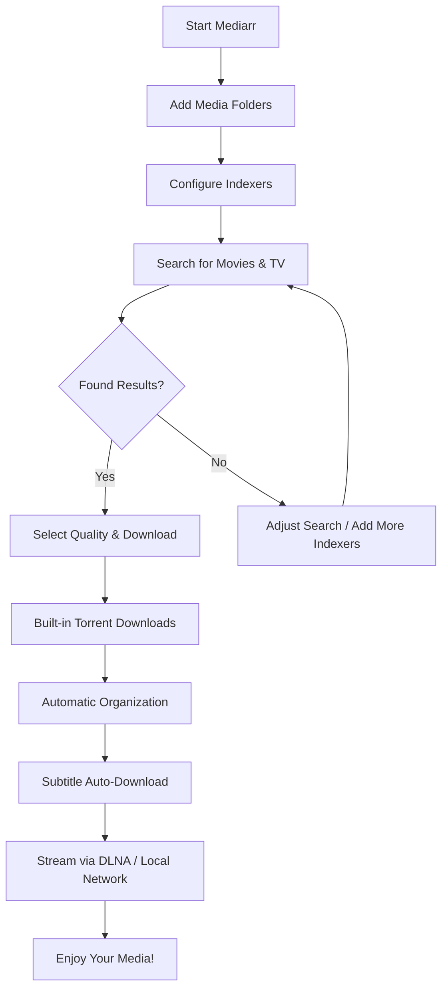

# Mediarr

The unified, all-in-one media management powerhouse that replaces the fragmented "arr" stack.

## Why Mediarr?

Managing your media collection shouldn't require a degree in system administration. Mediarr consolidates everything into one beautiful, modern interface:

- **One app, not five** — Replace Sonarr, Radarr, Bazarr, and Prowlarr with a single unified platform
- **Beautiful Dark UI** — Modern, intuitive dashboard that makes managing media effortless
- **Built-in Torrent Engine** — No external download clients needed
- **DLNA Streaming** — Stream directly to TVs and devices on your local network
- **Automatic Subtitles** — Finds and downloads subtitles automatically in your preferred languages

## Screenshots

### Dashboard

### Search

### Movie Library

### TV Library

### Calendar

### Activity Queue

## Getting Started

1. **Add your media folders** — Point Mediarr to where you store movies and TV shows
2. **Configure indexers** — Add your favorite torrent indexers (or use the built-in presets)
3. **Search and download** — Find content, select your preferred quality, and let Mediarr handle the rest
4. **Stream and enjoy** — Access your media via DLNA or browse your organized collection

## User Workflow

## Features

- **Unified Search** — Search movies and TV in one place
- **Quality Profiles** — Define your preferred quality settings
- **Calendar View** — See what's coming up across your shows
- **Activity Monitoring** — Track downloads in real-time
- **Automatic Subtitle Fetching** — Supports multiple providers
- **Custom Formats** — Fine-tune what to download with regex conditions
- **Collections** — Group related content together
- **Import Lists** — Pull content from Trakt, Radarr, or custom lists

## What's Next?

Mediarr is actively developed with new features coming:

- Enhanced mobile support
- More streaming protocols
- Advanced filtering and sorting
- Expanded subtitle provider support